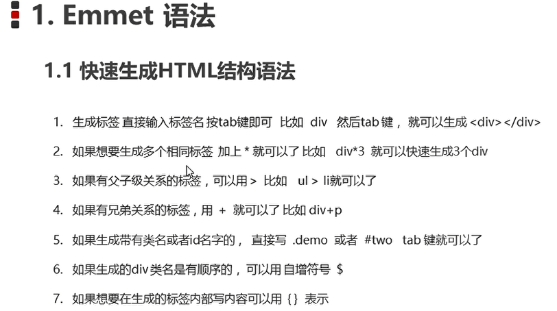

# 快速生成

- h$*6
- h1>(a#df$>br)*3
- table>tr*3>td*5{单元格文本}

## Emmet语法



```html
table>form>div.div0$*5{这是5个div1}+p.pro*2{这是$个p}+a[herf=#]
```

```html
<table>
 <form action="">
 	<div class="div01">这是5个div1</div>
 	<div class="div02">这是5个div1</div>
 	<div class="div03">这是5个div1</div>
 	<div class="div04">这是5个div1</div>
 	<div class="div05">这是5个div1</div>
 	<p class="pro">这是1个p</p>
 	<p class="pro">这是2个p</p>
	<a href="#"></a>
 </form>
</table>
```
