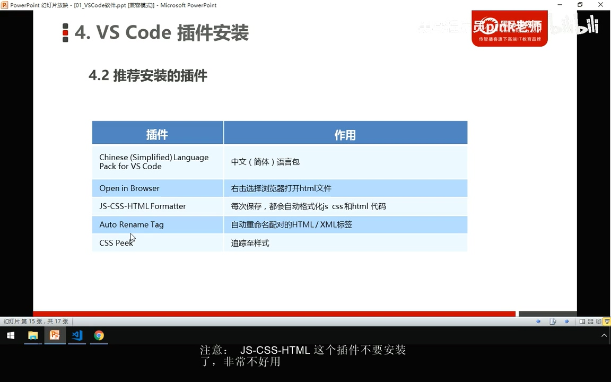
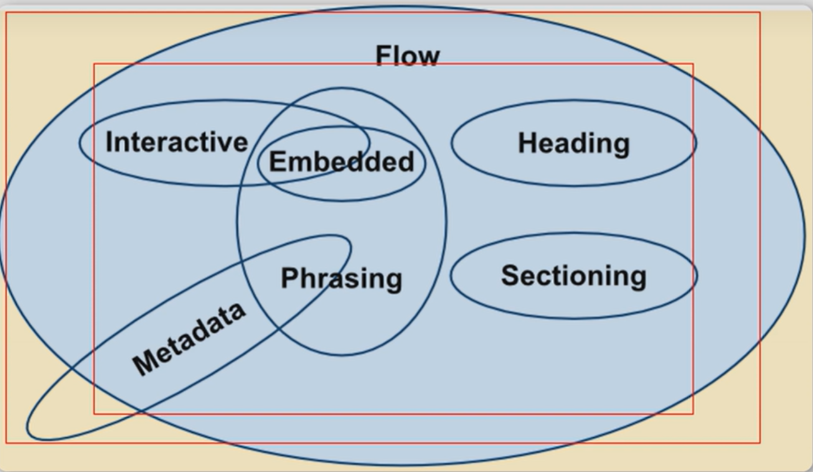

# html开篇

**tag**: #web/html

- [VSCODE插件推荐](#vscode插件推荐)
- [head标签](#head标签)
- [body标签](#body标签)
- [超链接](#超链接)
- [图像标签 @单标签](#图像标签-单标签)
- [表格标签](#表格标签)
- [列表](#列表)
- [表单](#表单)
  - [input元素 @单标签](#input元素-单标签)
  - [select下拉菜单元素](#select下拉菜单元素)
  - [文本域](#文本域)
- [`<label>`标签](#label标签)
- [元素类型](#元素类型)
  - [html5新增](#html5新增)


## VSCODE插件推荐



## head标签

### title

网站标题，关系到`SEO`, 影响搜索引擎排名

### meta @单标签

> 关系到html网页文档属性, 关键词等

```html
<mate charset="UTF-8">
```

## body标签
> 文本标签
| 功能                  |              代码              |
| --------------------- | :----------------------------: |
| <b>加粗</b>           | `<strong></strong>`, `<b></b>` |
| <em>倾斜</em>         |     `<em></em>`, `<i></i>`     |
| <del>删除线</del>     |    `<del></del>`, `<s></s>`    |
| <ins>下划线</ins>     |    `<ins></ins>`, `<u></u>`    |
| <span>万能标签</span> |        `<span></span>`         |
>其他标签
| 功能           |                   代码                    |
| -------------- | :---------------------------------------: |
| 注释标签       |    `<!--这里是注释-->`, 快捷键`ctrl+/`    |
| 换行           |                  `<br>`                   |
| 段落           |                 `<p></p>`                 |
| 水平线 @单标签 | `<hr color='' width='' size='' align=''>` |
| div            |         容器标签，为了刚好分段落          |

## 超链接
anchor 的缩写
```html
<a href='跳转目标' target="_self/_blank"> 文本或图像 </a>
<a href=./1-html-02.md target="_self"> 文本或图像 </a>
```
<a href=./1-html-02.md target="_blank">  </a>

### 锚点链接

快速定位到本页面的某个位置。

```html
<a href='#自己加的标识'>介绍</a>
<a href='#02'>第二章</a>
<a href='#021'>第二章内容</a>

<h4 id='02'> 这段话是第二章标题 </h4>
<p id='021'> 这段话是第二章内容 </p>
```

> <a href='#021'>第二章内容</a>
> <p id='021'> 这段话是第二章内容 </p>

## 图像标签 @单标签

``


### 图像标签参数

```html

```


## 表格标签

```html
 <table border="2" cellpadding="20" cellspacing="5" width="500px">
 <thead>
     <!-- <tr></tr> 为一个行的数据 -->
     <tr align="center"> <!-- <th> 表头标签-->
        <th>name</th> <th>age</th> <th>score</th>
    </tr>
 </thead>
 <tbody>
     <tr>
         <td align="right">tom</td> <td align="center">32</td> <td>89</td>
     </tr>
 </tbody>
 </table>
```

> 一般情况下不需要`tbody`与`thead`, 直接为 `table>tr*3>td*5{单元格文本}`

### 单元格合并

- 竖直, 跨行合并：`rowspan='合并个数'`
- 水平, 跨列合并：`colspan='合并个数'`

```html
 <table border="2" cellpadding="20" cellspacing="5" width="500px">
 <thead>
     <!-- <tr></tr> 为一个行的数据 -->
     <tr align="center"> <!-- <th> 表头标签-->
        <th>name</th> <th>age</th> 		<th>score</th>
    </tr>
 </thead>
 <tbody>
     <tr>
        <td colspan='2'>tom</td> 		<td>89</td>
     </tr>
 </tbody>
 </table>
```

- 跨行：最上侧单元格写代码
- 跨列：最左侧单元格写代码

## 列表

- 无序列表 `<ul> </ul>`中`<li></li>`

```html
<ul type="disc/circle/square/none">
    <li> list1 </li>
    <li> list2 </li>
    <li> list3 </li>
</ul>
```

- 有序列表 `<ol type="1/a/Ai/I"></ol>`
- 自定义列表 `<dl></dl>` 中 `<dt></dt> <dd></dd>`

## 表单

- `<form></form>`  ==表单域==

```html
<form action='url地址' method='提交方式get/post' name='表单域名称'>

</form>
```

### input元素 @单标签
**input元素** `说明文字: <input type='' name='' value='默认' maxlength='8'/>`

- `type`常用类型
    - `test` 文本框
    - `password`
    - `checkbox`
    - `radio` 显示选择框: <input type='radio' name='gender' value='man' />男 <input type='radio' name='gender' value='woman' checked='checked' />女
        - 要实现多选一，选择框的`name`属性必须一样，所以选择框的名字建议选择为类别名
        - #htext/question ==`radio` 与 `checkbox`的`value`值可以做为传送到后台的数据==
        - `checked='checked'`属性可以定义最初始选择，主要用于选择框`type`
    - `submit`提交按钮 <input type='submit' value='名字在value中更改'/>
    - `reset`提交按钮 <input type='reset' value='重置按钮可以重置该表单中的元素'/>
    - `button`普通按钮，搭配JS使用<input type='button' value='搭配JS使用'/>
    - `file` 上传文件<input type='file' value='选择文件'/>
    - `range` 滑块选择

[input详细内容](https://www.runoob.com/tags/tag-input.html)

### select下拉菜单元素

```html
<select>
    <option selected='selected'>选项1</option>
    <option>				  	选项2</option>
    <option>			      	选项3</option>
</select>
```

<select width='5000px'>
    <option >选项1</option>
    <option selected='selected'>选项2</option>
    <option>选项3</option>
</select>

### 文本域

```html
<textarea rows='3', cols='40'>请输入反馈信息</textarea>
<!--最好在一行完成,换行会使初始内容显示也换行-->
```
<textarea rows='3', cols='40'>请输入反馈信息</textarea>

## `<label>`标签

用于绑定多个元素，当点击`<lablel>`标签内的文本时，会自动视为点击对应的表单元素中，提高用户体验

```html
<label for='sex'>男</label>
<input name='sex' type='radio' id='sex' checked='checked'/>
```

<label for='sex-man'>男</label>
<input name='gender' type='radio' id='sex-man'/>
<label for='sex-woman'>女</label>
<input name='gender' type='radio' id='sex-woman' checked='checked'/>

## 元素类型

html5推出后, 放弃了原本的`块元素`与`行内元素`
> 分为元数据型(metadata content)、区块型(sectioning content)、标题型(heading content)、文档流型(flow content)、语句型(phrasing content)、内嵌型(embedded content)、交互型(interactive content)。元素不属于任何一个类别，被称为穿透的，元素可能属于不止一个类别，称为混和型



参考地址:https://developer.mozilla.org/zh-CN/docs/Web/HTML/Content_categories

- 常见块元素
> div,form, h1-h6,hr, p, table,ul

- 常见联内元素(行内元素)
> a、b、em、i、span、strong

- 行内块级元素
特点：不换行、能够识别宽高
> button、img、input等


### html5新增

| html5标签   | 描述                               |
| ----------- | ---------------------------------- |
| `<datalist` | 指定一个预先定义的输入控件选项列表 |
| `<output>`  | 定义一个计算结果                   |

> 由于大量的使用div标签，使得结构不清晰，所以html5新增很多标签，来替代div

从`html4`
```html
<div id="header"></div>
<div id="nav"></div>
<div id="article">
    <div id="section"></div>
</div>
<div id="silder"></div>
<div id="footer"></div>
```
到`html5`
```html
<header> </header>
<nav> </nav>
<article>
    <section> </section>
</article>
<aside> </aside>
<footer> </footer>
```

| 标签                   | 功能                      |
| ---------------------- | ------------------------- |
| `<header> </header>  ` | 头部                      |
| `<nav> </nav>        ` | 导航                      |
| `<article> </article>` | 文章, 帖子, 回复等        |
| `<section> </section>` | 文档中的节, 比如页眉,页脚 |
| `<aside> </aside>    ` | 侧边栏                    |
| `<footer> </footer>  ` | 底部                      |
