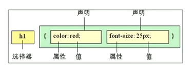

# CSS01

#web/css


> css是层叠样式表(Cascading Style Sheets)的简称



1. 内部样式表: 放到一个`<style>`标签中
2. 行内样式表: `<div style="color: pink; font-size: 12px;">只更此处的样式</div>`
3. 外部样式表: 使用`<link>`标签引入`.css`文件。`<link rel='stylesheet' herf='css文件路径' />`

- 在html文件中定义

```html
<!DOCTYPE html>
<html lang="en">
<head>
 <meta charset="UTF-8">
 <meta http-equiv="X-UA-Compatible" content="IE=edge">
 <meta name="viewport" content="width=device-width, initial-scale=1.0">
 <title>表格案例</title>
 <style>
	 p {
	 	color: red;
		font-size: 30px;
	 }
 </style>
</head>
```

---

- [选择器](#选择器)
	- [通配符选择器](#通配符选择器)
	- [类选择器](#类选择器)
	- [id选择器](#id选择器)
- [复合选择器](#复合选择器)
	- [后代选择器](#后代选择器)
	- [子选择器](#子选择器)
	- [并集选择器](#并集选择器)
	- [伪类选择器](#伪类选择器)

---

## 选择器

### 通配符选择器
> 自动给所有标签修改样式, 用于初始化

```html
<style>
	* {
		color: red;
	}
</style>
```

### 类选择器

```html
<style>
	.red {
		color: red;
	}
</style>

<p class='red'>将本段落通过class定义为class类</p>
```

### id选择器

> id只能调用1次

```html
<style>
	#red {
		color: red;
	}
</style>

<p id='red'>将本段落通过class定义为class类</p>
```

---

## 复合选择器

- [后代选择器](#后代选择器)
- [子选择器](#子选择器)
- [并集选择器](#并集选择器)
- [伪类选择器](#伪类选择器)

### 后代选择器

```html
<style>
	ol li {
		color: pink
	}
	.test li {
		color: red
	}
</style>

<ol>
	这里不变色
	<li>这里变色</li>
	<div><li>这里变色</li></div>
</ol>
<ul>
	<li>这里不变色</li>
</ul>
<ol class='test'>
	<li>这里红色</li>
</ol>
```

### 子选择器
```html
<style>
	ol>li {
		color: pink
	}
</style>

<ol>
	<li>这里变色</li>
	<div><li>这里不变色</li></div>
</ol>
```
### 并集选择器
```html
<style>
	ol li,
	ol div {
		color: pink
	}
</style>

<ol>
	<li>这里变色</li>
	<div>这里变色</div>
</ol>
```
### 伪类选择器

- 链接伪类 ==4个伪类的先后顺序不能改变,必须是LVHA, 但可与省略==
	- `a:link`: 选择所有未被访问的链接
	- `a:visited`: 选择所有已被访问的链接
	- `a:hober`: 鼠标位于其上的链接
	- `a:active`: 鼠标按下为弹起的链接
```html
<style>
    a {
        color: black;
        text-decoration: none;
    }
    a:visited{
        color: grey;
        text-decoration: none;
    }
    a:hover {
        color: blue;
        text-decoration: underline;
    }
```
- 焦点选择器
	- `input:focus` 选中input表单时的样式

