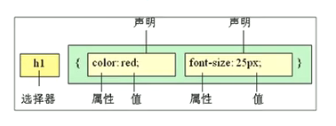

# CSS01

#web/css


> css是层叠样式表(Cascading Style Sheets)的简称



- 内部样式表: 放到一个`<style>`标签中
- 行内样式表: `<div style="color: pink; font-size: 12px;">只更此处的样式</div>`
- 外部样式表: 使用`<link>`标签引入`.css`文件。`<link rel='stylesheet' herf='css文件路径' />`

## 在html文件中定义

```html
<!DOCTYPE html>
<html lang="en">
<head>
 <meta charset="UTF-8">
 <meta http-equiv="X-UA-Compatible" content="IE=edge">
 <meta name="viewport" content="width=device-width, initial-scale=1.0">
 <title>表格案例</title>
 <style>
	 p {
	 	color: red;
		font-size: 30px;
	 }
 </style>
</head>
```

## 选择器

### 通配符选择器
> 自动给所有标签修改样式, 用于初始化

```html
<style>
	* {
		color: red;
	}
</style>
```

### 类选择器

```html
<style>
	.red {
		color: red;
	}
</style>

<p class='red'>将本段落通过class定义为class类</p>
```

### id选择器

> id只能调用1次

```html
<style>
	#red {
		color: red;
	}
</style>

<p id='red'>将本段落通过class定义为class类</p>
```

---

## 字体属性

```html
<style>
	body {
		font-family: Arial, 'Microsoft YaHei';
		font-size: 20px;
		font-weight: normal; <!-- normal| bold| bolder| lighter| 某个数字-->
		font-style: normal;<!--italic-->
	}
</style>
```

> 一般情况下，网页中不会有倾斜字体，所有常把`<em>`标签的字体设为正常字体

```html
<style>
	em {
		font-style: normal;<!--italic-->
	}
</style>

<em>字体变为正常字体</em>
```

### 字体复合属性

`font: font-style font-weight font-size/line-hight font-family;`

==font-size==与==font-family==为必须属性,必须要写

```html
<style>
	body {
		font: italic 600 16px 'Microsoft YaHei';
	}
</style>
```

## 字体外观样式

```html
<style>
	body {
		color: red;
		text-align: center; <!--水平对齐方式: left/right -->
		text-decoration: underline; <!-- 文字增加线: none/overline/line-through -->
		text-indent: 2em; <!-- 首行缩进,可以为负数,2em为当前元素2个文字的大小 -->
		line-height: 26px; <!-- 此选项由"上间距+文字高度+下间距"三者构成 -->
	}
</style>
```

