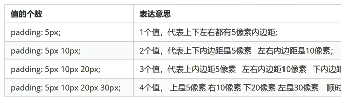

# 2-CSS-03

#web/css

## border
```css
border: border-width  border-style border-color
```

- `border-width` 定义边框粗细
- `border-style` 边框样式 `solid, none, hidden, dashed, dotted`等等
- `border-color` 边框颜色

### border-collaps
相邻边框层叠
```css
border-collapse: collapse;
```

## padding内边距



>  #htext/apply 使用padding可以简单实现几个文字与单词平均分布

## margin

顺序与padding一致

> 行内元素为了照顾其兼容性, 尽量只设置左右外边距,不要设置上下外边距

### 嵌套元素的`margin`塌陷问题

```css
.father {
	width: 400px;
	height: 400px;
	margin-top: 50px;
}
.son {
	width: 400px;
	height: 400px;
	margin-top: 10px;
}
```

此时, father与son的上距均为`60px`

解决方法
- 为父元素定义上边框 `border-top: 1px transport`
- 为父元素定义上内边距 `padding-top: 1px`
- 为父元素添加 `overflow: hidden`

## 弹性盒子模型

> 弹性盒子模型是为了更好的管理盒子中的子盒子，弹性盒子里的块元素默认为横向摆放

```html
<style>
    .flex-container {
		display: flex;

		<!-- 方向设置 -->
		<!-- row 横向， row-reverse 从右向左>
		<!-- column 纵向, column-reverse 从下到上>
		flex-direction:row;

		<!-- 对齐设置 上下对齐与左右对齐-->
		justify-content: flex-start | flex-end | center
		align-items: flex-start | flex-end | center
		height: 500px
		width:  500px
	}

	.inflex1; .inflex2 {
		<!-- 占父盒子的权重, 会根据flex-direction来抹去子盒子的宽或者高的属性>
		flex :2
		height: 100px
		width:  100px
	}

	.inflex3 {
		flex:1
		height: 100px
		width:  100px
	}
</style>


<div class="flex-container">
	<div class="inflex1">1</div>
	<div class="inflex2">2</div>
	<div class="inflex3">3</div>
</div>


```
